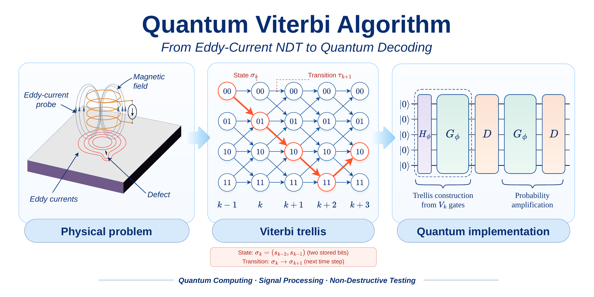

<h1 align="center">Viterbi Goes Quantum</h1>

<p align="center">
  <em>Decoding the most likely path with Grover's algorithm</em>
</p>

<p align="center">
  
  
  
  
</p>

<p align="center">
  
</p>

This package implements the **Quantum Viterbi Algorithm (QVA)** introduced by
[Grice and Meyer](https://doi.org/10.1007/s11128-015-1003-3): a phase oracle followed by
Grover amplitude amplification, which increases the probability of measuring the most
likely transmitted message. It decodes the rate-1/2 (5, 7) convolutional code and runs on
**Qiskit**, **PennyLane** or a fast **NumPy** simulator.

The code was developed for my Master's thesis in Computer Engineering at the University
of Cassino and Southern Lazio, which started from eddy-current non-destructive testing
(see [Theory](docs/theory.md)).

## ✨ Features

- One circuit, three backends: Qiskit, PennyLane and NumPy
- Exact probabilities or finite measurement shots
- The metric parameter ω tuned automatically for the received word
- Classical Viterbi decoder to compare against
- Ready-made plots, a command-line interface and unit tests

## 📦 Installation

```bash
git clone https://github.com/matteodisalvo/Quantum-Viterbi-Algorithm.git
cd Quantum-Viterbi-Algorithm

pip install -e .                 # Qiskit + NumPy
pip install -e ".[pennylane]"    # adds PennyLane
```

Requires Python 3.10 or newer.

## 🚀 Quick start

```python
from quantum_viterbi import decode

message = "101101"               # transmitted message
received = "11 01 00 10 00 00"   # its codeword after the channel flipped one bit

result = decode(received)        # omega is tuned for this word
print(result.summary(original=message))
```

```text
Quantum Viterbi decoding
  original message  : 101101
  original codeword : 11 01 00 10 10 00
  received word     : 11 01 00 10 00 00  (1 bit error)
  qubits (N)        : 6
  omega             : 0.6819 rad (tuned)
  Grover iterations : 6
  backend           : qiskit (exact)
  decoded message   : 101101  (P = 0.2931)
  decoded codeword  : 11 01 00 10 10 00
  bits flipped      : 1
  classical Viterbi : 101101  (same as QVA)
  outcome           : correct
```

The decoder only needs the received word; `original` is optional and adds the checks at
the end of the report. The same call works on every backend:

```python
decode(received, backend="pennylane")  # or "numpy", or "qiskit" (the default)
decode(received, shots=4096)           # simulate measurement shots
decode(received, omega=0.5)            # set omega yourself
```

## ⚖️ Classical vs quantum

The classical Viterbi algorithm scans the trellis once and always returns a
maximum-likelihood path. The QVA holds all $2^N$ paths in superposition and measures one
of them with a probability that depends on ω and on the number of Grover iterations:

```python
from quantum_viterbi import decode, viterbi_decode

viterbi_decode(received)  # 101101, always
decode(received)          # 101101 with P = 0.2931
```

## 🎯 Choosing ω

ω decides how strongly the amplification favors the best path, and the right value
depends on the received word: with a bad ω the algorithm amplifies the wrong path. This
is why `decode` tunes it by default, and you can also ask for it directly:

```python
from quantum_viterbi import resonant_omega, tuned_omega

tuned_omega(received)     # 0.6819, what decode() uses: a grid search on distance classes
resonant_omega(received)  # 0.6677 and K = 9, computed from the distance spectrum
```

[Choosing ω](docs/choosing-omega.md) explains the grid search, the resonance and the
limits of each rule.

## 💻 Command line

```bash
quantum-viterbi decode 11 01 00 10 00 00 --original 101101 --backend pennylane
quantum-viterbi viterbi 11 01 00 10 00 00 --original 101101
quantum-viterbi scan 11 01 00 10 00 00 --target 101101 --plot
quantum-viterbi circuit 11 01 00 --omega 0.5 --iterations 1
```

## 📂 Examples

| Script                             | What it shows                                                 |
|------------------------------------|---------------------------------------------------------------|
| `examples/01_decode_noisy_word.py` | classical and quantum decoding of the same word, with plots   |
| `examples/02_choosing_omega.py`    | probability versus ω: tuned value, resonance and aliased path |
| `examples/03_circuits.py`          | circuit drawing, OpenQASM and the three backends              |

## 📚 Documentation

- [Theory](docs/theory.md): from eddy currents to the convolutional code, the classical
  Viterbi algorithm and the QVA step by step.
- [Choosing ω](docs/choosing-omega.md): tuning, grid search and the resonance.
- **Thesis**: not yet available — coming soon.

## 🗂️ Project structure

```text
src/quantum_viterbi/
├── convolutional.py   # encoder, Hamming distances and classical Viterbi decoder
├── gates.py           # framework-independent gate list
├── oracle.py          # trellis gates V_k and phase oracle G(ω)
├── grover.py          # Grover diffusion and full circuit
├── matrices.py        # reference matrix implementation
├── spectrum.py        # distance spectrum and exact simulation on distance classes
├── backends/          # Qiskit, PennyLane and NumPy
├── tuning.py          # choice of ω: tuning, scans and resonance
├── decoder.py         # decode()
├── plotting.py        # figures
└── cli.py             # command-line interface
```

## 🧪 Tests

```bash
pip install -e ".[dev]"
pytest
ruff check . && ruff format --check .
```

## 👥 Authors

This project comes from the Master's thesis *Algoritmo di Viterbi Quantistico*
(Computer Engineering, University of Cassino and Southern Lazio, academic year 2023–2024).

| Role          | Name                                                                  | Affiliation                              |
|---------------|-----------------------------------------------------------------------|------------------------------------------|
| Student       | Matteo Di Salvo                                                       | University of Cassino and Southern Lazio |
| Supervisor    | [Prof. Antonello Tamburrino](https://orcid.org/0000-0003-2462-6350)   | University of Cassino and Southern Lazio |
| Co-supervisor | [Prof. Antonio Corbo Esposito](https://orcid.org/0000-0003-4582-0128) | University of Cassino and Southern Lazio |
| Co-supervisor | [Eng. Vincenzo Mottola, PhD](https://orcid.org/0000-0002-8358-4544)   | University of Cassino and Southern Lazio |

## 📖 References

The quantum algorithm is based on:

J. R. Grice and D. A. Meyer,
*A quantum algorithm for Viterbi decoding of classical convolutional codes*,
Quantum Information Processing **14**(7), 2307–2321 (2015).
[doi:10.1007/s11128-015-1003-3](https://doi.org/10.1007/s11128-015-1003-3) ·
[arXiv:1405.7479](https://arxiv.org/abs/1405.7479)

```bibtex
@article{grice2015quantum,
  title   = {A quantum algorithm for {Viterbi} decoding of classical convolutional codes},
  author  = {Grice, Jon R. and Meyer, David A.},
  journal = {Quantum Information Processing},
  volume  = {14},
  number  = {7},
  pages   = {2307--2321},
  year    = {2015},
  doi     = {10.1007/s11128-015-1003-3},
  eprint  = {1405.7479},
  archivePrefix = {arXiv}
}
```

Classical background:

- A. J. Viterbi, *Error bounds for convolutional codes and an asymptotically optimum decoding algorithm*, IEEE Transactions on Information Theory **13**(2), 260–269 (1967). [doi:10.1109/TIT.1967.1054010](https://doi.org/10.1109/TIT.1967.1054010)
- G. D. Forney, *The Viterbi algorithm*, Proceedings of the IEEE **61**(3), 268–278 (1973). [doi:10.1109/PROC.1973.9030](https://doi.org/10.1109/PROC.1973.9030)
- L. K. Grover, *A fast quantum mechanical algorithm for database search*, Proceedings of STOC '96, 212–219 (1996). [doi:10.1145/237814.237866](https://doi.org/10.1145/237814.237866)

Viterbi algorithm for eddy-current testing:

- A. Tamburrino, *A communications theory approach for electromagnetic inverse problems*, IEEE Transactions on Magnetics **36**(4), 1136–1139 (2000). [doi:10.1109/20.877641](https://doi.org/10.1109/20.877641)
- R. Albanese, G. Rubinacci, A. Tamburrino and F. Villone, *Phenomenological approaches based on an integral formulation for forward and inverse problems in eddy current testing*, International Journal of Applied Electromagnetics and Mechanics **12**(3–4), 115–137 (2000). [doi:10.3233/JAE-2000-214](https://doi.org/10.3233/JAE-2000-214)

## 📄 License

Released under the [MIT License](LICENSE).
