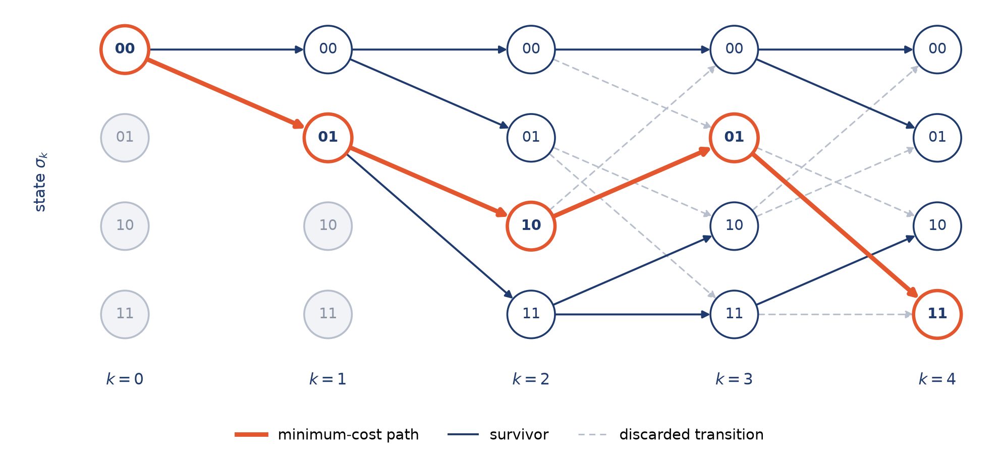
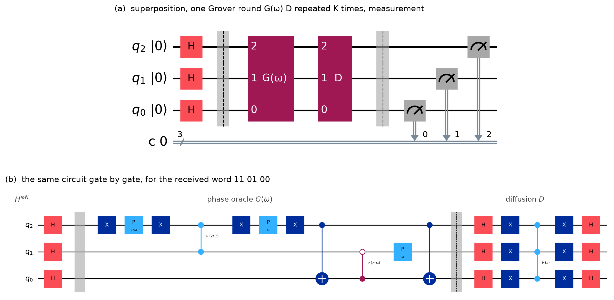

# Theory

How the decoding problem is set up, how the classical Viterbi algorithm solves it and how
the Quantum Viterbi Algorithm turns it into a Grover search. See also
[Choosing ω](choosing-omega.md) and the [README](../README.md).

## From eddy currents to a convolutional code

This work started from a physical problem: **eddy-current non-destructive testing**.
A probe scans a metallic plate to detect defects, and the signal measured at each
position depends on the material under the probe, that is, on a short window of
unknown values. Reconstructing the plate profile can therefore be modeled as a
sequence-estimation problem:

$$\tilde z_k = g(s_{k-L}, \dots, s_k) + n_k, \qquad \min_{\lbrace s_k \rbrace} \sum_k \lVert \tilde z_k - g(s_{k-L}, \dots, s_k) \rVert^2$$

This analogy with digital communications over noisy channels was introduced by
[Tamburrino](https://doi.org/10.1109/20.877641): once the measurement is truncated to
a finite window, the Viterbi algorithm solves the problem as a minimum-path search on
a trellis. The QVA encodes all the trellis paths at once in a quantum superposition.

To study the quantum algorithm in a controlled setting, the thesis and this
repository use a simpler instance of the same problem: decoding a rate-1/2 (5, 7)
convolutional code, where $g$ is the encoder and the branch metric is the Hamming
distance. The trellis structure is the same, but every result can be checked
exactly. Applying the QVA to real eddy-current signals is the natural next step.

## The Viterbi algorithm

The Viterbi algorithm solves the minimization above step by step, without trying
every possible sequence. It relies on four simple ideas:

- **State** $\sigma_k = (s_{k-L}, \dots, s_{k-1})$: the last $L$ symbols, i.e. the memory of the system.
- **Transition** $\tau_{k+1} = (\sigma_k, \sigma_{k+1})$: the move to the next state when a new symbol $s_k$ arrives.
- **Branch metric** $\lambda(\tau_{k+1}) = \lVert \tilde z_k - g(\tau_{k+1}) \rVert^2$: how far a transition is from the measured data.
- **Trellis**: all the states at every time step, connected by the transitions. Each sequence is a path, and its cost is the sum of its branch metrics.

Let $m_k(\sigma_k)$ be the cost of the best path reaching $\sigma_k$. At each step every
state keeps only this best incoming path, the *survivor*:

$$m_{k+1}(\sigma_{k+1}) = \min_{\sigma_k \to \sigma_{k+1}} \big[\, m_k(\sigma_k) + \lambda(\tau_{k+1}) \,\big]$$

At the end, the state with the smallest cost is traced back to recover the sequence.

  

For the (5, 7) code used here, $L = 2$ (four states), $g$ is the encoder and $\lambda$
reduces to the Hamming distance. The package implements it as `viterbi_decode`.

## How the QVA works

**1. Encoding.** A message $u = (u_1, \dots, u_N)$ is encoded with the rate-1/2
(5, 7) convolutional code, starting from the all-zero state ($u_0 = u_{-1} = 0$):

$$c_t(u) = \left(u_t \oplus u_{t-2},\; u_t \oplus u_{t-1} \oplus u_{t-2}\right), \qquad t = 1, \dots, N$$

The channel flips some bits, and the decoder receives the pairs $r_1, \dots, r_N$.

**2. Path metric.** Each candidate message is scored by the Hamming distance
between its codeword and the received word:

$$d_H(u) = \sum_{t=1}^{N} \delta_t(u), \qquad \delta_t(u) = \mathrm{wt}\big(c_t(u) \oplus r_t\big) \in \lbrace 0, 1, 2 \rbrace$$

On a binary symmetric channel with crossover probability $p < 1/2$, maximum-likelihood
decoding looks for
$\hat u = \arg\min_u d_H(u)$: the path found by the classical Viterbi algorithm
described above, and the one the quantum decoder is designed to amplify.

**3. Superposition.** With one qubit per transition, Hadamard gates prepare all
$2^N$ candidates at once:

$$|s\rangle = H^{\otimes N} |0\rangle^{\otimes N} = \frac{1}{\sqrt{2^N}} \sum_{u \in \lbrace 0,1 \rbrace^N} |u\rangle$$

**4. Trellis gates $V_k$ and phase oracle.** Each trellis step $k = 0, \dots, N-1$
is implemented by a gate $V_k$. The first two steps start from the known all-zero
state and use the lighter initialization gates $V_{i0}$ and $V_{i1}$. The previous
qubits hold the trellis state $\sigma_k = (u_{k-1}, u_k)$. From it, $V_k$ puts the
new qubit $u_{k+1}$ in superposition and gives each outgoing branch a phase
proportional to its branch metric:

$$V_k\,|\sigma_k\rangle|0\rangle = |\sigma_k\rangle \otimes \frac{1}{\sqrt{2}} \sum_{j \in \lbrace 0,1 \rbrace} e^{i\omega\,\delta_{k+1}(\sigma_k,\, j)}\,|j\rangle$$

Here $\delta_{k+1}(\sigma_k, j)$ is the Hamming distance between the pair emitted by
that branch and the received pair $r_{k+1}$.

Each $V_k$ is a Hadamard gate on the new qubit followed by a diagonal phase block.
The Hadamards act on fresh qubits, so they can all be moved to the front. The
cascade of trellis gates then splits into the Grover initialization $H_\phi = H^{\otimes N}$
and the phase oracle $G_\phi = G(\omega)$:

$$V_{N-1} \cdots V_2\, V_{i1}\, V_{i0}\,|0\rangle^{\otimes N} = G(\omega)\,H^{\otimes N}|0\rangle^{\otimes N} = G(\omega)\,|s\rangle$$

$$G(\omega)\,|u\rangle = e^{i\omega\, d_H(u)}\,|u\rangle = \prod_{t=1}^{N} e^{i\omega\, \delta_t(u)}\,|u\rangle$$

**5. Amplitude amplification.** The diffusion operator reflects the state about
$|s\rangle$. Alternating it with the oracle $K$ times can amplify the candidate with
the smallest metric, provided ω is chosen suitably:

$$D = 2|s\rangle\langle s| - I, \qquad |\psi_K\rangle = \big(D\,G(\omega)\big)^K |s\rangle, \qquad K = \left\lfloor \frac{\pi}{4}\sqrt{2^N} \right\rfloor$$

  

The circuit for a three-bit message and the received word `11 01 00`, with one Grover
round. The top wire carries the first information bit $u_1$; Qiskit numbers qubits
little-endian, so it is drawn as $q_2$. In (b) the dashed lines separate the three blocks:
the phase gates are the trellis gates of step 4, and the integer in front of ω is the
branch metric $\delta_t \in \lbrace 0, 1, 2 \rbrace$ of that transition. The same circuit
is printed as text by `quantum-viterbi circuit 11 01 00 --iterations 1`.

**6. Measurement.** Each message is observed with probability

$$P(u) = \big|\langle u | \psi_K \rangle\big|^2, \qquad \hat u_{\mathrm{QVA}} = \arg\max_u P(u)$$

Since $d_H(u)$ is an integer, $P(u)$ is $2\pi$-periodic in ω. Phases are only defined
modulo $2\pi$, so a path with many errors can receive almost the same phase as one
with few errors: ω has to be tuned, which is the subject of
[Choosing ω](choosing-omega.md).
